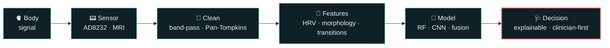

<!-- ═══════════════════════════ HEADER ═══════════════════════════ -->
<p align="center">
  
</p>

<p align="center">
  
  
  
  
</p>

## `$ whoami`

```yaml
name:       Mohammed Yusuf J
pronouns:   he/him
studying:   B.Tech — Computer Science & Medical Engineering (AI & Data Analytics)
university: Sri Ramachandra Institute of Higher Education and Research, Chennai
building:   real-time biosignal systems · clinical decision support · practical software people actually use
currently:  Alpixe Corp
```

> I like the space where a heartbeat becomes a waveform, the waveform becomes features, and the features become a decision a clinician can trust.

<br/>

## 🩺 Experience

```diff
+ Dec 2025 – Feb 2026   Biomedical Engineer Intern     · Voluntary Health Services, Chennai

+ May 2025 – Jun 2025   Research Intern                · SRIHER, Chennai
    ▸ Portable real-time ECG monitor (AD8232) with Pan-Tompkins QRS detection, 5–15 Hz band-pass
    ▸ Hybrid arrhythmia classifier: Random Forest + clinical decision-rule thresholds, 11 HRV/morphology features
    ▸ Validated on 287 MIT-BIH ECGs across Normal · PVC · Bradycardia · Tachycardia · AFib
    ▸ 98.26% accuracy · 0.0% false-negative rate · 99.2% bradycardia specificity — presented as a poster

+ May 2024 – Jul 2024   Research Intern                · SRIHER, Chennai
    ▸ Drug delivery for epilepsy patients — 3D printing & medical research
```

<br/>

## 🫀 Projects

<table>
<tr>
<td width="50%" valign="top">

### 💓 Real-time ECG Arrhythmia Monitor
AD8232 acquisition → Pan-Tompkins → HRV + morphology features → hybrid RF / rule-based classifier. **98.26 %** accuracy, **zero missed arrhythmias** on 287 MIT-BIH records.

`Python` `MATLAB` `Arduino` `scikit-learn`

</td>
<td width="50%" valign="top">

### 📈 MTA-ECG
**Morphological Transition Analysis** — measures how beat morphology *moves* into and recovers from arrhythmia (displacement, velocity, acceleration, curvature, entry–recovery asymmetry) instead of treating beats as independent.

`Python` `MIT-BIH` `Signal Processing`

</td>
</tr>
<tr>
<td width="50%" valign="top">

### 🧠 Multimodal Brain Stroke Detection
MRI models (CNN · VGG16 · ResNet) fused with a clinical tabular DNN through cross-modal attention, with Grad-CAM explanations for every prediction.

`Deep Learning` `Grad-CAM` `Colab`

</td>
<td width="50%" valign="top">

### 🧾 [YCH Billing System](https://github.com/yusufmj2005/YCH-Billing-System)
Offline POS for Windows retail shops — GST billing, invoices, stock ledger, purchases, returns, reports, staff and automatic backups, shipped as a one-click installer.

`Python` `SQLite` `Windows`

</td>
</tr>
<tr>
<td width="50%" valign="top">

### 🕸️ [Corp-Map](https://github.com/yusufmj2005/Corp-Map)
Search listed and private companies worldwide and map their parents, subsidiaries and brands as interactive flow charts.

`React` `TypeScript` `Tailwind` `Wikidata`

</td>
<td width="50%" valign="top">

### 🔐 [DACMS](https://github.com/yusufmj2005/DACMS)
Data Access Control Management System — JWT auth, bcrypt hashing and server-enforced role-based access (ADMIN / USER).

`Node.js` `Express` `JWT` `LibSQL`

</td>
</tr>
</table>

<br/>

## 🧰 Toolkit

<details open>
<summary><b>Languages</b></summary>
<br/>


</details>

<details open>
<summary><b>AI · Biosignals · Devices</b></summary>
<br/>


</details>

<details open>
<summary><b>Web & Apps</b></summary>
<br/>


</details>

<details>
<summary><b>Domain</b></summary>
<br/>

`Biomedical Engineering` · `Clinical Decision Support` · `Biosensors` · `Molecular Diagnostics` · `Biotechnology` · `3D Printing`

</details>

<br/>

## 🏅 Recent

- 🧬 **BioGrantX — Euphoria 2026**, Kalasalingam Academy of Research and Education · explored molecular diagnosis and biosensor-based approaches
- 🖼️ Poster presentation — real-time ECG arrhythmia detection, SRIHER departmental showcase

<br/>

## 🧭 Right now

| | |
|:--|:--|
| 🔬 **Researching** | MTA-ECG — whether arrhythmia *transition dynamics* add information beyond beat-level morphology and RR features |
| 🛠️ **Building** | Practical software at **Alpixe Corp** |
| 🧬 **Exploring** | Biosensors and molecular diagnostics at the edge of biotech and AI |
| 🎓 **Graduating** | May 2027 · open to collaborating on medical-device and AI-for-healthcare work |

<br/>

## 🔁 How I build



<br/>

## 📡 Reach me

<p align="center">
  <a href="https://www.linkedin.com/in/yusufmj2005"></a>
  <a href="mailto:yusufmj2005@gmail.com"></a>
</p>

<p align="center">
  
</p>
